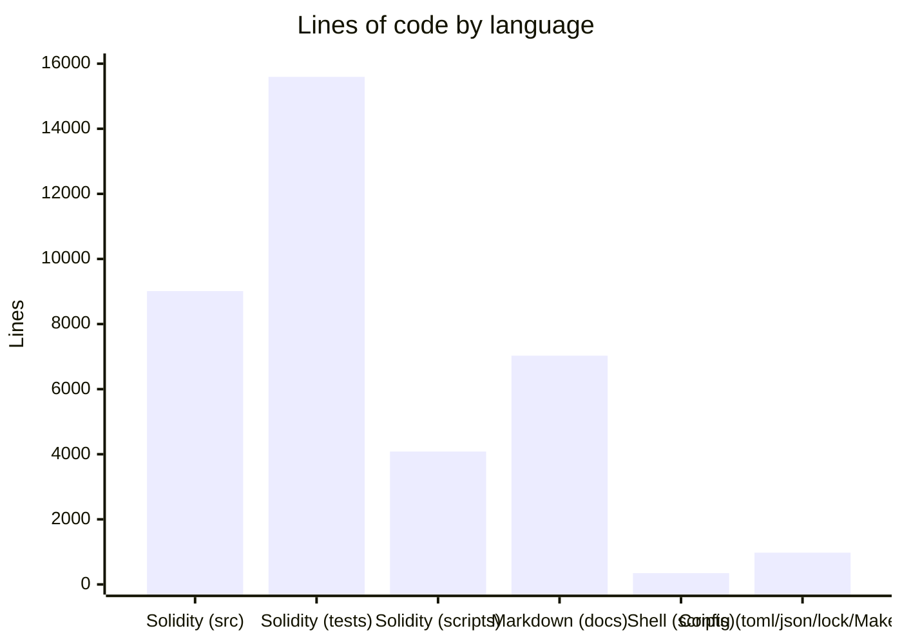

# KAM by the Numbers

> Data collected on May 2026. Excludes vendored and auto-generated code.

## Size

### Lines of code by language



| Language / Category | Lines | Files |
|---|---|---|
| Solidity source (non-vendor) | 9,012 | 39 |
| Solidity tests | 15,594 | 49 |
| Solidity deployment scripts | 4,083 | 15 |
| Markdown (project docs) | 7,028 | 19 |
| Shell | 348 | 1 |
| Config (toml, json, yaml, Makefile, lock) | 976 | 6 |
| **Total (project-authored)** | **~37,000** | **~129** |

Additionally: **5,507 lines** of vendored Solidity across 32 files (`src/vendor/`), and ~24,300 lines of auto-generated Foundry documentation (`foundry-docs/`). Neither is counted above.

**Test-to-source ratio:** 1.73× — more test code than production code.

### File counts by category

| Category | Files |
|---|---|
| Source (src/, non-vendor) | 39 |
| Tests (test/) | 49 |
| Deployment scripts (script/) | 15 |
| Configuration files | 6 |
| Project documentation | ~20 |
| **Project-authored total** | **~129** |

## Activity

**Total commits since 2025-01-01:** 300

**Monthly commit activity:**

| Period | Commits | Notable |
|---|---|---|
| May 2025 | 5 | Project genesis |
| Jul 2025 | 47 | Core protocol build-out |
| Aug 2025 | 6 | Quiet period |
| Sep 2025 | 49 | Feature sprint |
| Oct 2025 | 34 | Adapter system |
| Nov 2025 | 19 | Token factory, batch changes |
| Dec 2025 | 59 | Sprint: insurance, gas, CI, NatSpec |
| Jan 2026 | 15 | Audit fixes |
| Feb 2026 | 3 | Quiet |
| Mar 2026 | 24 | Post-audit hardening |
| Apr 2026 | 25 | Post-audit phases 1-12 |
| May 2026 | 14 | Settlement refactor (in progress) |

### Recent churn (since Feb 2026)

```
Top changed files:
    21  src/kStakingVault/kStakingVault.sol
    20  src/kAssetRouter.sol
    13  src/kStakingVault/modules/ReaderModule.sol
    12  docs/architecture.md
    11  test/unit/kAssetRouter.t.sol
    11  src/interfaces/IVault.sol
    10  src/kStakingVault/base/BaseVault.sol
    10  docs/interfaces.md
     9  test/invariant/handlers/kStakingVaultHandler.t.sol
     9  test/integration/KAM.t.sol
```

The highest-churn files (`kStakingVault.sol`, `kAssetRouter.sol`) reflect the ongoing settlement refactor on the current branch.

## Bot-attributed commits

Commits with `Co-authored-by` trailer: **78** of **300** (26%).

This is a **lower bound** — commits authored directly by a bot without the co-author trailer are not counted, and some may use different attribution patterns. The protocol has a meaningful share of AI-assisted development across its history.

## Complexity

### Largest source files (non-vendor)

| File | Lines |
|---|---|
| `src/kRegistry/kRegistry.sol` | 973 |
| `src/kAssetRouter.sol` | 950 |
| `src/interfaces/IRegistry.sol` | 791 |
| `src/kStakingVault/kStakingVault.sol` | 758 |
| `src/kMinter.sol` | 556 |
| `src/kStakingVault/base/BaseVault.sol` | 479 |
| `src/interfaces/IkAssetRouter.sol` | 469 |
| `src/interfaces/modules/IExecutionGuardian.sol` | 383 |
| `src/base/kBase.sol` | 328 |
| `src/kRegistry/modules/ExecutionGuardianModule.sol` | 294 |

### Average file size by source directory

| Directory | Files | Total lines | Avg lines/file |
|---|---|---|---|
| `src/kRegistry/` | 3 | 1,376 | ~458 |
| `src/kStakingVault/` | 4 | 1,551 | ~387 |
| `src/errors/` | 1 | 225 | 225 |
| `src/base/` | 4 | 757 | ~189 |
| `src/interfaces/` | 18 | 2,723 | ~151 |
| `src/libraries/` | 1 | 151 | 151 |
| `src/adapters/` | 4 | 517 | ~129 |
| `src/constants/` | 1 | 41 | 41 |

The `kRegistry` directory has the highest average complexity at ~458 lines/file, driven by the 973-line `kRegistry.sol`. The `interfaces` directory is the largest in total lines (2,723) due to extensive NatSpec documentation on public APIs.

---

*See also: [overview/architecture.md](overview/architecture.md), [overview/glossary.md](overview/glossary.md)*
