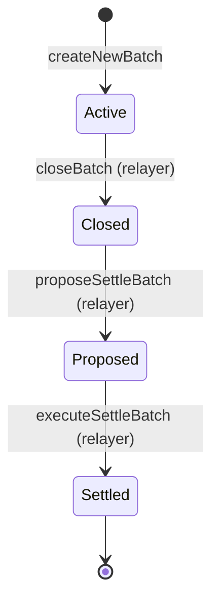

# Batch processing

Active contributors: Based on git history, see [maintainers](../maintainers.md).

## Purpose

Batch processing groups user requests (mints, redemptions, stakes, unstakes) into time-based periods for gas-efficient, fair-priced settlement. Instead of processing each user operation individually — which would be prohibitively expensive — the protocol accumulates requests into batches, settles them in bulk, and then lets users claim their outcomes individually. This design is the backbone of both institutional flows (kMinter) and retail flows (kStakingVault).

## How it works

### Batch lifecycle

Every batch progresses through a four-stage state machine:

| Stage | Meaning | Who triggers | What's allowed |
|-------|---------|-------------|----------------|
| **Active** | Accepting new requests | `createNewBatch` by relayer or (for kMinter) registry | `mint`, `requestBurn`, `requestStake`, `requestUnstake` |
| **Closed** | No new requests; awaiting settlement proposal | `closeBatch` by relayer | View functions only; requests already in the batch advance |
| **Proposed** | Settlement proposal created in kAssetRouter | `proposeSettleBatch` by relayer | Settlement proposal awaits cooldown and optional guardian approval |
| **Settled** | Batch finalized; users can claim | `settleBatch` by kAssetRouter | `burn`, `claimStakedShares`, `claimUnstakedAssets` |

### Batch creation

**kMinter (`src/kMinter.sol`)**: Each supported asset (USDC, WBTC) gets its own independent batch cycle tracked by `assetBatchCounters` and `currentBatchIds` mappings. When a relayer calls `createNewBatch(asset)`, the contract:

1. Increments the per-asset batch counter (`assetBatchCounters[asset]++`)
2. Generates a deterministic batch ID via `OptimizedEfficientHashLib.hash(address(this), assetBatchNumber, chainId, timestamp, uint160(asset))` — five entropy sources prevent collision and prediction attacks
3. Sets `currentBatchIds[asset]` to the new ID and initializes fresh `BatchInfo` storage (`isClosed = false`, `isSettled = false`)

Batches can also be auto-created during `closeBatch` by passing `_create = true`.

**kStakingVault (`src/kStakingVault/kStakingVault.sol`)**: Each vault maintains a single batch pipeline for its underlying asset. `createNewBatch` is called by relayers and uses the vault-level `currentBatch` counter with hashing over `(address(this), currentBatch, chainId, timestamp, uint160(underlyingAsset))`.

### Request grouping

During the Active stage, all user requests are routed to the current batch:

- **kMinter.mint()**: Deposits accumulate in `batch.depositedInBatch` (uint128) and update `totalLockedAssets`
- **kMinter.requestBurn()**: Redemptions accumulate in `batch.requestedSharesInBatch` (uint128); kTokens are escrowed in kMinter
- **kStakingVault.requestStake()**: kToken deposits accumulate in `batch.depositedInBatch`; kTokens locked in vault; `totalPendingStake` incremented
- **kStakingVault.requestUnstake()**: stkToken burn requests accumulate in `batch.requestedSharesInBatch`; stkTokens transferred to vault

### Per-batch caps

Both kMinter and kStakingVault enforce per-batch limits configured in kRegistry via `setBatchLimits()`:

- `getMaxMintPerBatch(target)` — caps `depositedInBatch` accumulation
- `getMaxBurnPerBatch(target)` — caps `requestedSharesInBatch` accumulation

For kMinter, the target is the **asset address** (`kMinter`). For kStakingVault, the target is the **vault address**. Setting a cap to 0 disables the corresponding operation for that asset/vault.

### Batch closure

Relayers call `closeBatch(batchId, create)` to:

1. Set `batch.isClosed = true` — blocks new requests from being added
2. Optionally create a new batch for the same asset/vault (`createNewBatch`) so users can continue submitting requests into the next cycle

A batch must be closed before it can be proposed for settlement in kAssetRouter.

### Batch settlement (`settleBatch`)

Called **only by kAssetRouter** during settlement execution:

**kMinter**: Burns all escrowed kTokens for the batch at once (`kToken.burn(address(this), requestedSharesInBatch)`), decrements `totalLockedAssets`, and marks `batch.isSettled = true`. Individual users later call `burn(requestId)` to claim underlying assets from the batch receiver.

**kStakingVault**: A complex multi-step process:
1. Accrues management fees (mints stkToken shares to treasury)
2. Calculates interest since last settlement, charges performance fees with hurdle rate
3. Mints stkToken shares for pending stake deposits at settlement-time prices
4. Burns stkToken shares for pending unstake requests, reserves kTokens in `totalPendingUnstake`
5. Snapshots `totalAssets` and `totalSupply` into the batch for fair individual claim pricing
6. Audits kToken balance against expected invariant (`totalAssets + totalPendingStake + totalPendingUnstake`)

### kBatchReceiver

For kMinter batches, a minimal proxy `kBatchReceiver` (`src/kBatchReceiver.sol`) is deployed per batch using Solady's `LibClone`. It receives underlying assets from kAssetRouter during settlement and distributes them to individual users during `burn()`. The receiver is created lazily on the first `requestBurn` call for a batch.

## Integration points

| Contract | Batch role |
|----------|-----------|
| `kMinter` | Creates/closes per-asset batches; settles batch on router call; deploys batch receivers |
| `kStakingVault` | Creates/closes vault batches; settles on router call (fees, mint/burn shares, price snapshot) |
| `kAssetRouter` | Proposes settlement for closed batches; executes settlement; calls `settleBatch` on vaults |
| `kRegistry` | Stores per-asset and per-vault batch caps (`maxMintPerBatch`, `maxBurnPerBatch`) |
| `kBatchReceiver` | Receives underlying assets during settlement; distributes to individual kMinter users |

## Key source files

| File | Description |
|------|-------------|
| `src/kMinter.sol` | Institutional batch system: `_createNewBatch`, `closeBatch`, `settleBatch` |
| `src/kStakingVault/kStakingVault.sol` | Retail vault batch system: `_createNewBatch`, `closeBatch`, `settleBatch` |
| `src/kStakingVault/base/BaseVault.sol` | Batch storage struct (`BaseVaultStorage.batches`) and shared utilities |
| `src/kStakingVault/types/BaseVaultTypes.sol` | `BaseVaultTypes.BatchInfo` struct definition |
| `src/kAssetRouter.sol` | Settlement proposal and execution that triggers `settleBatch` on vaults |
| `src/kBatchReceiver.sol` | Per-batch asset distribution for kMinter |
| `src/interfaces/IkMinter.sol` | `IkMinter.BatchInfo` struct and batch event definitions |
| `src/errors/Errors.sol` | Batch-related error codes (M1–M16, SV1–SV13, VB1–VB3) |

## Related pages

- [Settlement proposals](settlement-proposals.md) — two-phase settlement with timelock
- [Virtual accounting](virtual-accounting.md) — how adapter balances are tracked virtually during batch lifecycles
- [Role-based access](role-based-access.md) — RELAYER_ROLE and how it governs batch operations
- [Institutional gateway](../systems/kminter.md)
- [Retail staking vault](../systems/kstaking-vault.md)
- [Money flow coordinator](../systems/kasset-router.md)
