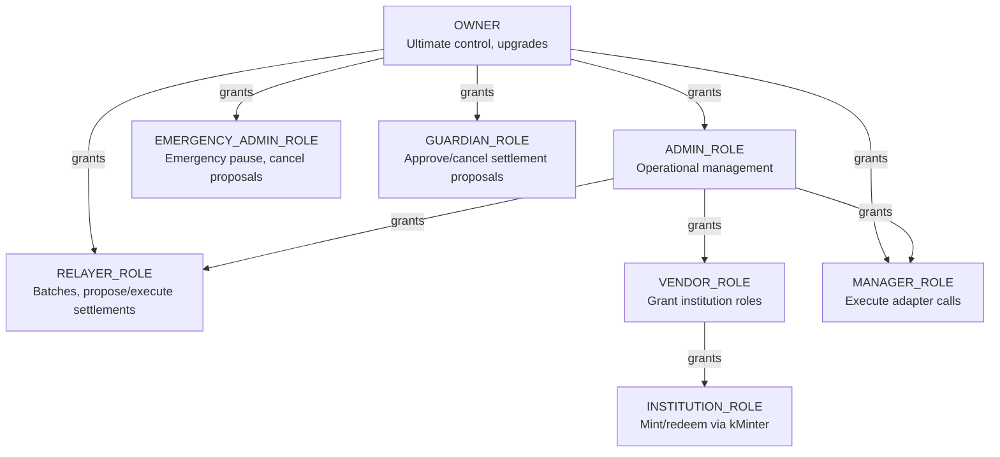
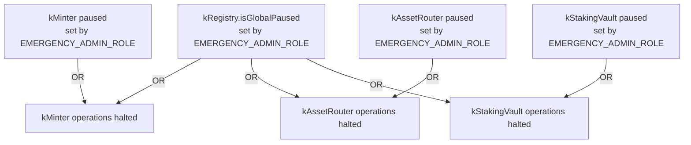

# Role-based access

Active contributors: Based on git history, see [maintainers](../maintainers.md).

## Purpose

KAM enforces a granular 8-role hierarchy that separates protocol ownership, administration, circuit breaking, automation, and user privileges. Every state-changing function across all contracts is gated by role checks. The system uses Solady's `OptimizedOwnableRoles` for gas-efficient bitmap-based role storage, with role definitions in `kBaseRoles` (`src/base/kBaseRoles.sol`) and role queries delegated to `kRegistry` (`src/kRegistry/kRegistry.sol`).

## How it works

### Role hierarchy

Roles are defined as bitmask constants in `kBaseRoles`:

| Constant | Bit position | Value |
|----------|-------------|-------|
| `OWNER` | inherited from Solady `Ownable` | — |
| `ADMIN_ROLE` | `_ROLE_0` | `1 << 0` |
| `EMERGENCY_ADMIN_ROLE` | `_ROLE_1` | `1 << 1` |
| `GUARDIAN_ROLE` | `_ROLE_2` | `1 << 2` |
| `RELAYER_ROLE` | `_ROLE_3` | `1 << 3` |
| `INSTITUTION_ROLE` | `_ROLE_4` | `1 << 4` |
| `VENDOR_ROLE` | `_ROLE_5` | `1 << 5` |
| `MANAGER_ROLE` | `_ROLE_6` | `1 << 6` |

A single address can hold multiple roles. Role checks use `hasAnyRole(user, roleBit)` which is an `AND` + compare on the user's bitmap.

### Dual-role grants in initialization

`kBaseRoles.__kBaseRoles_init` grants two roles at once to convenience addresses for testnet deployments:

- **`_admin`** is granted both `ADMIN_ROLE` **and** `VENDOR_ROLE`
- **`_relayer`** is granted both `RELAYER_ROLE` **and** `MANAGER_ROLE`

Production deployments should use separate addresses. The owner can revoke and re-grant roles after initialization via `revokeRoles` and `grantRoles`.

### Role details

#### OWNER

The contract owner (Solady `Ownable`). Exclusive permissions:
- **UUPS upgrades**: `_authorizeUpgrade` on kMinter, kAssetRouter, kStakingVault
- **Role management**: grant/revoke ADMIN_ROLE, EMERGENCY_ADMIN_ROLE, GUARDIAN_ROLE via kRegistry (also available to ADMIN_ROLE for some roles — see grant policies)
- **Ownership transfer**: `transferOwnership`, `renounceOwnership`

#### ADMIN_ROLE

Operational management across all contracts:
- **kRegistry**: register/remove vaults and adapters, set batch limits, set hurdle rates, set treasury/insurance config
- **kAssetRouter**: set settlement cooldown, set maxAllowedDelta per vault
- **kMinter**: rescue stuck assets from batch receivers
- **kStakingVault**: set management and performance fees, set max total assets
- **kRegistry**: grant/revoke RELAYER_ROLE, MANAGER_ROLE, VENDOR_ROLE

#### EMERGINARY_ADMIN_ROLE

Emergency shutdown and protocol-wide pause:
- **All contracts**: pause/unpause (local per-contract pause via `setPaused`)
- **kRegistry**: set global pause (`setGlobalPause`) which affects all contracts simultaneously
- **kAssetRouter**: cancel any pending settlement proposal

#### GUARDIAN_ROLE

Circuit breaker for settlement safety:
- **kAssetRouter**: approve high-delta settlement proposals (`acceptProposal`)
- **kAssetRouter**: cancel any pending settlement proposal (`cancelProposal`)

#### RELAYER_ROLE

Automated batch and settlement operations:
- **kMinter**: create and close batches (`createNewBatch`, `closeBatch`)
- **kStakingVault**: create and close vault batches (`createNewBatch`, `closeBatch`)
- **kAssetRouter**: propose settlements (`proposeSettleBatch`), execute settlements (`executeSettleBatch`)

#### INSTITUTION_ROLE

Privileged institutional access:
- **kMinter**: mint kTokens 1:1 with underlying assets (`mint`), request redemptions (`requestBurn`), claim redeemed assets (`burn`)

Granted by VENDOR_ROLE (or ADMIN_ROLE as backstop).

#### VENDOR_ROLE

Institutional onboarding:
- **kRegistry**: grant and revoke INSTITUTION_ROLE

#### MANAGER_ROLE

Adapter-level execution:
- **VaultAdapter**: execute permitted function calls on external DeFi protocols

### Emergency pause mechanism

KAM implements a **dual-pause** model:

- **Global pause** (`kRegistry.isGlobalPaused()`): Affects all contracts. Set by `EMERGENCY_ADMIN_ROLE` via `setGlobalPause(bool)`. Checked in `_isPaused()` for contracts inheriting `kBase`, and in `_getPaused()` for `BaseVault`.
- **Local pause**: Each contract has its own `paused` flag (in `kBaseStorage` for kMinter/kAssetRouter, in packed `config` for BaseVault). Set by `EMERGENCY_ADMIN_ROLE` via each contract's `setPaused(bool)`.

A contract is considered paused if **either** its local flag **or** the global flag is true (OR logic). This allows both surgical pauses of individual contracts and protocol-wide emergency shutdown.

When paused, **all state-changing functions revert** (mint, burn, stake, unstake, propose, execute, etc.). **View functions remain accessible** for monitoring.

Role checks like `_isRelayer`, `_isGuardian`, `_isAdmin` all delegate to `kRegistry`, which queries its own `OptimizedOwnableRoles` storage. This means role membership is managed in one place (kRegistry) and consumed everywhere via the interface, avoiding fragmented role state across contracts.

## Role-to-contract permissions matrix

| Function | OWNER | ADMIN | EMERGENCY_ADMIN | GUARDIAN | RELAYER | INSTITUTION | VENDOR | MANAGER |
|----------|:-----:|:-----:|:---------------:|:--------:|:-------:|:-----------:|:------:|:-------:|
| UUPS upgrade | ✓ | | | | | | | |
| Register/remove vaults | | ✓ | | | | | | |
| Register/remove assets | | ✓ | | | | | | |
| Set batch limits | | ✓ | | | | | | |
| Set fees (mgmt/perf) | | ✓ | | | | | | |
| Set settlement cooldown | | ✓ | | | | | | |
| Set maxAllowedDelta | | ✓ | | | | | | |
| Global pause | | | ✓ | | | | | |
| Local pause | | | ✓ | | | | | |
| Cancel proposals | | | ✓ | ✓ | | | | |
| Approve proposals | | | | ✓ | | | | |
| Create/close batches | | | | | ✓ | | | |
| Propose/execute settlements | | | | | ✓ | | | |
| Mint/redeem kTokens | | | | | | ✓ | | |
| Grant institution role | | ✓ | | | | | ✓ | |
| Execute adapter calls | | | | | | | | ✓ |
| Grant roles | ✓ | ✓¹ | | | | | | |

¹ ADMIN can grant RELAYER_ROLE, MANAGER_ROLE, VENDOR_ROLE. Only OWNER can grant ADMIN_ROLE, EMERGENCY_ADMIN_ROLE, GUARDIAN_ROLE.

## Key source files

| File | Description |
|------|-------------|
| `src/base/kBaseRoles.sol` | Role constant definitions and initialization with dual-role grants |
| `src/kRegistry/kRegistry.sol` | Central role storage and query interface (`isAdmin`, `isRelayer`, etc.); role grant/revoke functions |
| `src/base/kBase.sol` | Role check functions consumed by contracts (`_isAdmin`, `_isRelayer`, `_isGuardian`, `_isEmergencyAdmin`, `_isInstitution`) |
| `src/kMinter.sol` | Role checks: `_checkInstitution` (mint/burn), `_checkRelayer` (closeBatch), `_checkRouter` (settleBatch) |
| `src/kAssetRouter.sol` | Role checks: `_checkAdmin`, `_checkRelayer`, `_isGuardian`, `_isEmergencyAdmin` |
| `src/kStakingVault/kStakingVault.sol` | Role checks: `_checkAdmin`, `_checkRelayer`, `_checkRouter`, `_isEmergencyAdmin` |
| `src/kStakingVault/base/BaseVault.sol` | Local pause flag in packed config; `_getPaused` with OR logic for global pause |
| `src/errors/Errors.sol` | Role error codes: KB2 (KROLESBASE_WRONG_ROLE), M7 (KMINTER_WRONG_ROLE), A16 (KASSETROUTER_WRONG_ROLE), SV7 (KSTAKINGVAULT_WRONG_ROLE) |

## Related pages

- [System architecture](../overview/architecture.md) — contract overview and role assignment flow
- [Security model](../security/index.md) — trust boundaries, threat model around roles
- [Central configuration hub](../systems/kregistry.md) — where roles are stored and managed
- [Institutional gateway](../systems/kminter.md)
- [Money flow coordinator](../systems/kasset-router.md)
- [Retail staking vault](../systems/kstaking-vault.md)
- [Protocol terms](../overview/glossary.md) — role definitions
