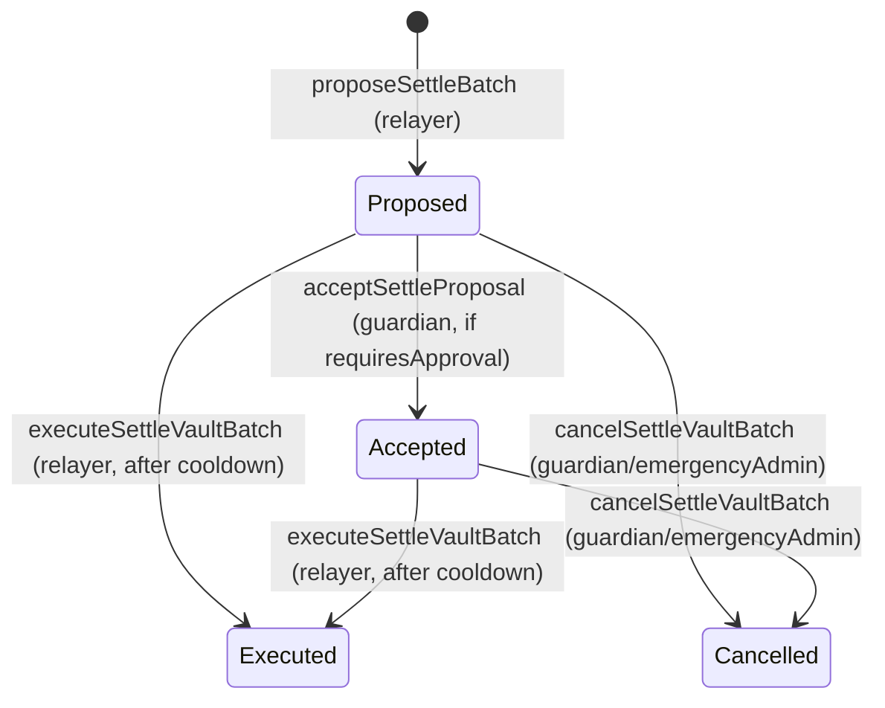

# Settlement proposals

Active contributors: Based on git history, see [maintainers](../maintainers.md).

## Purpose

Settlement proposals implement a two-phase security mechanism for yield distribution in KAM. Before any batch settlement can execute — minting or burning kTokens, updating adapter balances, distributing yield — a relayer must propose the settlement, and it must survive a cooldown period with optional guardian review. This prevents racing conditions, gives oversight actors time to detect anomalies, and ensures yield calculations are verified before they become irreversible.

## How it works

### Proposal state machine

### Proposal creation (`proposeSettleBatch`)

A relayer calls `kAssetRouter.proposeSettleBatch(asset, vault, batchId, totalAssets)` with the adapter's current total assets. The function:

1. Registers the batch ID in the router's tracking set (prevents duplicate proposals)
2. Verifies the batch is closed via `vault.isClosed(batchId)`
3. Checks no pending proposal exists for the same vault-asset pair (kMinter allows multiple per vault but only one per asset; staking vaults allow exactly one pending proposal)
4. Generates a unique `proposalId` via `OptimizedEfficientHashLib.hash(vault, asset, batchId, timestamp, counter)`
5. Computes netting: `depositedInBatch - requestedInBatch` (positive = net deposit, negative = net withdrawal)
6. Calculates yield: `totalAssets - lastVirtualBalance`
7. Checks yield tolerance; if exceeded, sets `requiresApproval = true`
8. For kMinter proposals, validates and decrements `globalPendingRequests`
9. Sets `executeAfter = block.timestamp + vaultSettlementCooldown`

### Cooldown period

The cooldown is configurable by admins via `setSettlementCooldown(seconds)`:
- **Default**: 1 hour (3600 seconds)
- **Maximum**: 1 day (86400 seconds)

During the cooldown, the proposal is visible but not executable. Guardians can review the proposed `totalAssets` against off-chain data, check yield calculations, and cancel if discrepancies are found. The cooldown gives protocols time to detect anomalies before irreversible kToken mint/burn operations.

### Yield tolerance (`maxAllowedDelta`)

Each vault has a per-vault `maxAllowedDelta` (basis points, configured via `setMaxAllowedDelta(vault, delta)`). When a proposal's absolute yield exceeds `lastTotalAssets * maxAllowedDelta / MAX_BPS`:

- The proposal is created with `requiresApproval = true`
- A `YieldExceedsMaxDeltaWarning` event is emitted
- The proposal **cannot be executed** until a guardian calls `acceptProposal(proposalId)`

For a vault's first settlement (no prior virtual balance), non-zero yield reverts with `KASSETROUTER_FIRST_SETTLEMENT_NON_ZERO_YIELD` to prevent unverified bootstrapping.

### Guardian approval (`acceptProposal`)

Guardians call `acceptProposal(proposalId)` to approve high-delta proposals. This:
- Verifies the proposal exists, is pending, and requires approval
- Sets `acceptedProposals[proposalId] = true`
- The proposal remains subject to the cooldown check at execution time

Guardians cannot approve proposals that don't require approval (reverts with `KASSETROUTER_NO_APPROVAL_REQUIRED`).

### Guardian/emergency admin cancellation (`cancelProposal`)

Both guardians and emergency admins can cancel any pending proposal via `cancelProposal(proposalId)`. Cancellation:
- Removes the proposal from the vault's pending queue
- For kMinter proposals, restores `globalPendingRequests` that were decremented at propose time
- Removes the batch ID from the router's tracking
- The relayer can re-propose with corrected data

### Execution (`executeSettleBatch`)

Relayers call `executeSettleBatch(proposalId)` once the cooldown has passed and (if required) the proposal has been accepted:

1. Verifies the proposal exists in the vault's pending queue
2. Checks `block.timestamp >= executeAfter` (cooldown elapsed)
3. If `requiresApproval`, verifies `acceptedProposals[proposalId] == true`
4. Removes the proposal from the pending queue and adds it to the executed set
5. Calls `_executeSettlement(proposal)` which dispatches to kMinter or staking vault logic

### Settlement execution logic

**kMinter settlement (`_executeMinterSettlement`)**:
- Pulls requested assets from the kMinter adapter to the batch receiver
- Emits `Deposited` or `Withdrawn` events based on netting
- Calls `kMinter.settleBatch(batchId)` to burn escrowed kTokens
- Updates adapter `totalAssets` with delta-based approach: `newTotal = oldTotal + netted`

**Staking vault settlement (`_executeVaultSettlement`)**:
- If yield > 0: mints kTokens to the vault, increases vault's internal `totalBalance`
- If yield < 0: burns kTokens from the vault, decreases vault's internal `totalBalance` (reverts if insufficient active assets)
- Updates kMinter adapter: `newTotal = oldTotal - netted` (reflects assets moved to the staking vault)
- Calls `vault.settleBatch(batchId)` to process pending stakes/unstakes at settlement-time prices
- Updates vault adapter `totalAssets` to the proposed value
- Decrements `globalPendingRequests[kMinter][asset]` by the batch's `depositedInBatch`

### Proposal status checks

`canExecuteProposal(proposalId)` returns `(bool, ProposalStatus)` for off-chain monitoring:

| Status | Meaning |
|--------|---------|
| `EXECUTABLE` | Ready to execute |
| `NOT_FOUND` | Proposal doesn't exist |
| `ALREADY_EXECUTED` | Already processed |
| `CANCELLED` | Removed from pending queue |
| `COOLDOWN_NOT_PASSED` | Still within cooldown period |
| `REQUIRES_APPROVAL` | Guardian acceptance needed |

## Integration points

| Contract | Settlement role |
|----------|----------------|
| `kAssetRouter` | Creates proposals, enforces cooldown/approval, executes settlement, calls `settleBatch` |
| `kMinter` | Batch is settled via `settleBatch` call; adapter assets pulled for redemptions |
| `kStakingVault` | Batch is settled via `settleBatch` call; yield distributed as kToken mint/burn + balance adjustment |
| `kRegistry` | Stores per-vault `maxAllowedDelta`, adapter-to-vault mappings |
| `VaultAdapter` | Holds physical assets; `totalAssets()` updated during execution |
| `kToken` | Minted for positive yield, burned for negative yield during vault settlement |

## Key source files

| File | Description |
|------|-------------|
| `src/kAssetRouter.sol` | Full settlement proposal lifecycle: `proposeSettleBatch`, `executeSettleBatch`, `cancelProposal`, `acceptProposal`, `_executeSettlement`, `_executeMinterSettlement`, `_executeVaultSettlement` |
| `src/kMinter.sol` | `settleBatch` — burns escrowed kTokens when called by router |
| `src/kStakingVault/kStakingVault.sol` | `settleBatch` — processes stakes/unstakes when called by router; `increaseBalance`/`decreaseBalance` for yield |
| `src/kStakingVault/base/BaseVault.sol` | Fee accrual, settlement balance snapshots used in yield calculations |
| `src/interfaces/IkAssetRouter.sol` | `VaultSettlementProposal` struct, `ProposalStatus` enum, all event definitions |
| `src/errors/Errors.sol` | Settlement error codes (A1–A28) |

## Related pages

- [Batch processing](batch-processing.md) — how batches feed into settlement proposals
- [Virtual accounting](virtual-accounting.md) — how adapter balances are reconciled at settlement
- [Role-based access](role-based-access.md) — GUARDIAN_ROLE and RELAYER_ROLE in settlement
- [Money flow coordinator](../systems/kasset-router.md)
- [Security model](../security/index.md) — trust boundaries around settlement execution
- [Protocol terms](../overview/glossary.md) — cooldown, yield tolerance, guardian definitions
