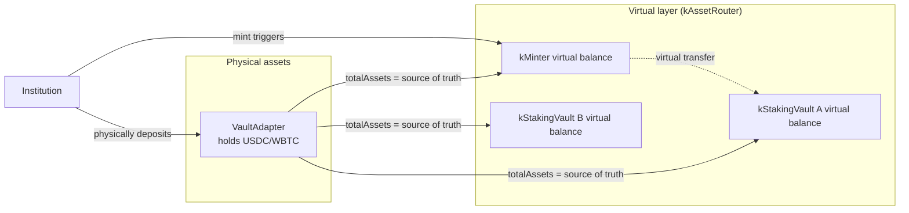

# Virtual accounting

Active contributors: Based on git history, see [maintainers](../maintainers.md).

## Purpose

Virtual accounting is the protocol's gas-optimized approach to tracking asset ownership across vaults without requiring physical asset transfers for every operation. Instead of moving underlying tokens between contracts on every stake or redemption, the protocol updates accounting entries — virtual balances — in kAssetRouter and its registered adapters. Physical transfers are batched and deferred to settlement, dramatically reducing transaction costs while maintaining strict 1:1 backing guarantees.

## How it works

### The virtual balance model



Virtual balances are maintained per vault, per asset. The core insight: **the adapter's `totalAssets()` is the single source of truth**. Virtual balances are computed from adapter totals, adjusted by pending settlement proposals that haven't been executed yet.

### Balance tracking

kAssetRouter tracks virtual balances through adapter integration:

- **`_virtualBalance(vault, asset)`** — reads `adapter.totalAssets()` for the registered vault-adapter pair. This reflects the actual asset holdings for that vault.
- **`_effectiveVirtualBalanceInt(vault, asset)`** — the real-time balance used for authorization checks. Starts from `_virtualBalance`, then iterates over all **pending proposals** for the vault and adds their `netted` values (deposits minus requested redemptions). This accounts for committed-but-unsettled operations.

### Asset push / request pull

Three entry points update the virtual accounting state:

| Function | Caller | Effect |
|----------|--------|--------|
| `kAssetPush(asset, amount, batchId)` | kMinter | Physically transfers assets to the adapter; no virtual state change needed since `adapter.totalAssets()` auto-reflects the new balance |
| `kAssetRequestPull(asset, amount, batchId)` | kMinter | Increments `globalPendingRequests[kMinter][asset]`; validates sufficient virtual balance exists to cover all pending requests across batches |
| `kAssetTransfer(sourceVault, targetVault, asset, amount, batchId)` | kStakingVault | Increments `globalPendingRequests[sourceVault][asset]`; validates virtual balance sufficiency. This is a **virtual transfer** — no physical asset movement; actual reallocation happens at settlement |

The `globalPendingRequests` mapping prevents cross-batch over-requests. For example, if kMinter has 1000 USDC in its adapter, and three staking vault batches collectively request 1200 USDC via `kAssetTransfer`, the third call reverts with `KASSETROUTER_INSUFFICIENT_VIRTUAL_BALANCE`.

### Virtual inter-vault transfers (staking)

When a retail user stakes kTokens via `kStakingVault.requestStake()`, the vault calls:

```
kAssetRouter.kAssetTransfer(kMinter, thisVault, asset, amount, batchId)
```

This is **entirely virtual**:
- No underlying assets move between adapters
- `globalPendingRequests[kMinter][asset]` is incremented
- The transfer is "committed" by adding the amount to the staking vault's batch `depositedInBatch`
- At settlement, kAssetRouter adjusts both the kMinter adapter's `totalAssets` and the staking vault adapter's `totalAssets` to reflect the reallocation

### getBatchIdBalances

`kAssetRouter.getBatchIdBalances(vault, batchId)` returns `(deposited, requested)` for any vault-batch pair. For kMinter, it reads `BatchInfo.depositedInBatch` and `BatchInfo.requestedSharesInBatch` directly. For kStakingVault, it reads the same from `getBatchIdInfo`. This provides a unified interface for off-chain monitoring and settlement proposal construction.

### Settlement reconciliation

During `_executeVaultSettlement`, virtual balances are reconciled with physical reality:

1. **Yield distribution**: kTokens are minted (positive yield) or burned (negative yield) for the staking vault; vault's internal balance is increased/decreased
2. **kMinter adapter update**: `kMinterAdapter.setTotalAssets(kMinterAdapter.totalAssets() - netted)` — reflects the net deposits/redemptions that occurred in this batch
3. **Vault adapter update**: `vaultAdapter.setTotalAssets(totalAssets)` — sets the vault adapter to the proposed total
4. **Pending request cleanup**: `globalPendingRequests[kMinter][asset]` is decremented by the batch's `depositedInBatch` to release the reserved capacity

The delta-based approach (`totalAssets() - netted` instead of direct set) makes kMinter adapter updates commutative — multiple staking vaults settling in different orders produce the same result.

## Gas optimization rationale

Without virtual accounting, every inter-vault operation would require:

1. Physical asset transfer from adapter A to adapter B (one or more ERC20 transfers + DeFi protocol interactions)
2. Adapter A recalculation
3. Adapter B recalculation

With virtual accounting, only a single `sstore` update (incrementing `globalPendingRequests`) is needed per request. The actual DeFi rebalancing is deferred to settlement, where one bulk operation replaces hundreds of individual ones. This is the core gas optimization that makes retail staking economically viable.

## Integration points

| Contract | Virtual accounting role |
|----------|------------------------|
| `kAssetRouter` | Maintains virtual balance tracking, global pending requests, adapter total asset coordination |
| `kMinter` | Triggers `kAssetPush` and `kAssetRequestPull` |
| `kStakingVault` | Triggers `kAssetTransfer` for virtual inter-vault reallocation |
| `VaultAdapter` | Holds physical assets; `totalAssets()` is the source of truth for virtual balances |
| `kRegistry` | Stores adapter-to-vault mappings (`getAdapter`) |

## Key source files

| File | Description |
|------|-------------|
| `src/kAssetRouter.sol` | Virtual balance functions: `_virtualBalance`, `_effectiveVirtualBalanceInt`, `_checkSufficientVirtualBalance`, `kAssetPush`, `kAssetRequestPull`, `kAssetTransfer`, `getBatchIdBalances`, `getGlobalPendingRequests` |
| `src/kMinter.sol` | Calls `kAssetPush` on mint, `kAssetRequestPull` on requestBurn |
| `src/kStakingVault/kStakingVault.sol` | Calls `kAssetTransfer` on requestStake |
| `src/adapters/VaultAdapter.sol` | Adapter with `totalAssets()` serving as source of truth |
| `src/interfaces/IkAssetRouter.sol` | Interface definitions for all virtual accounting functions |
| `src/errors/Errors.sol` | Error codes: A6 (insufficient virtual balance), A26 (virtual balance negative), A17/A18 (zero address/amount) |

## Related pages

- [Batch processing](batch-processing.md) — how batches group requests that virtual accounting tracks
- [Settlement proposals](settlement-proposals.md) — how virtual balances are reconciled at settlement
- [Money flow coordinator](../systems/kasset-router.md) — deep dive into kAssetRouter
- [Institutional gateway](../systems/kminter.md)
- [Retail staking vault](../systems/kstaking-vault.md)
- [Protocol terms](../overview/glossary.md) — glossary definitions for virtual balance, kAssetPush, kAssetRequestPull
