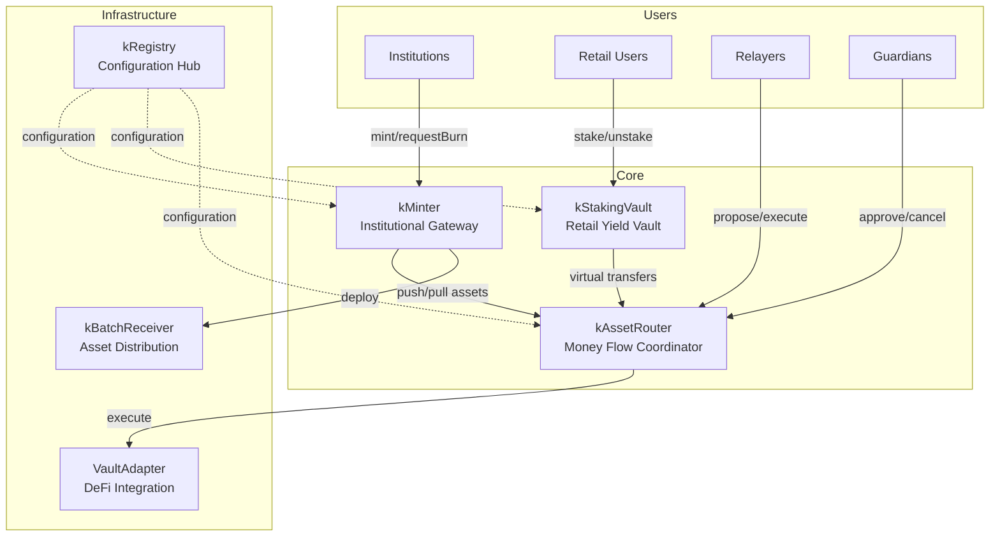

# Architecture

KAM is built as a Solidity monorepo using Foundry's toolchain. The protocol consists of five core contracts connected through a central registry, with modular vaults, adapter-based DeFi integration, and a batch settlement system.

## System architecture



## Contract layer

| Contract | Role | File |
|----------|------|------|
| `kRegistry` | Central configuration hub, asset/vault registry, role management | `src/kRegistry/kRegistry.sol` |
| `kMinter` | Institutional mint/burn with 1:1 kToken backing | `src/kMinter.sol` |
| `kAssetRouter` | Virtual balance accounting, settlement proposals, yield distribution | `src/kAssetRouter.sol` |
| `kStakingVault` | Retail staking with share-based accounting and fee management | `src/kStakingVault/kStakingVault.sol` |
| `VaultAdapter` | Permission-based external DeFi protocol interaction | `src/adapters/VaultAdapter.sol` |
| `kBatchReceiver` | Minimal proxy for isolated per-batch asset distribution | `src/kBatchReceiver.sol` |

## Base layer

| Contract | Role | File |
|----------|------|------|
| `kBase` | Shared registry integration, pause, rescue, reentrancy guard | `src/base/kBase.sol` |
| `kBaseRoles` | Role-based access control (7 roles + ownable) | `src/base/kBaseRoles.sol` |
| `MultiFacetProxy` | Selector-based function routing to module implementations | `src/base/MultiFacetProxy.sol` |
| `ERC2771Context` | Meta-transaction support via trusted forwarder | `src/base/ERC2771Context.sol` |

## Key data flows

### Institutional mint flow

```
Institution → kMinter.mint(asset, to, amount)
    → Transfer underlying asset to kAssetRouter
    → kAssetRouter.kAssetPush() updates virtual balance
    → kToken.mint(to, amount) issues tokens 1:1
```

### Institutional redeem flow

```
Institution → kMinter.requestBurn(asset, to, amount)
    → Escrow kTokens in kMinter
    → kAssetRouter.kAssetRequestPull() records request
    → Relayer closes batch → proposes settlement → executes
    → kMinter.settleBatch() burns escrowed kTokens
    → Institution calls kMinter.burn(requestId)
    → kBatchReceiver.pullAssets(to, amount) distributes underlying
```

### Retail staking flow

```
Retail → kStakingVault.requestStake(kToken, amount)
    → Lock kTokens
    → Relayer proposes/executes settlement
    → Retail calls claimStakedShares() → receives stkTokens
    → Yield earned over time from external strategy returns
    → Retail calls requestUnstake(stkToken, amount)
    → Claim underlying kTokens after settlement
```

## Storage patterns

All contracts use **ERC-7201 namespaced storage** to prevent collisions across upgrades. Each contract defines its storage struct at a deterministic slot computed via `keccak256(namespace) - 1 & ~0xff`. This allows safe addition of new state variables in future upgrades.

The `kStakingVault` also uses **MultiFacetProxy** to route function selectors to separate module implementations (ReaderModule), keeping the core contract focused and enabling module upgrades independently.

## Proxy pattern

All core contracts are **UUPS upgradeable** (via Solady's `UUPSUpgradeable`). The `kRegistry` additionally uses `MultiFacetProxy` for modular function routing. Ownership of UUPS proxies can be transferred to an Admin Timelock for governance-controlled upgrades. See [Deployment](../deployment/index.md) for details on the timelock handover process.

## External dependencies

| Dependency | Purpose |
|------------|---------|
| `kToken0` | kToken ERC20 implementation with roles, blacklist, and LayerZero OFT support |
| `minimal-smart-account` | ERC-4337 smart account for insurance fund custody |
| `minimal-uups-factory` | Gas-optimized UUPS proxy factory for kToken deployment |
| `forge-std` | Foundry test utilities |
| `solady` (vendored) | Gas-optimized utilities (Ownable, SafeTransferLib, FixedPointMathLib, etc.) |
| `openzeppelin` (vendored) | Proxy base contract, ERC4626 interfaces |
| `uniswap` (vendored) | Extsload for storage reading optimization |

## Language breakdown

The codebase is entirely Solidity (0.8.30), with Shell scripts for deployment automation and a Makefile for task orchestration. See [By the numbers](../by-the-numbers.md) for detailed statistics.
