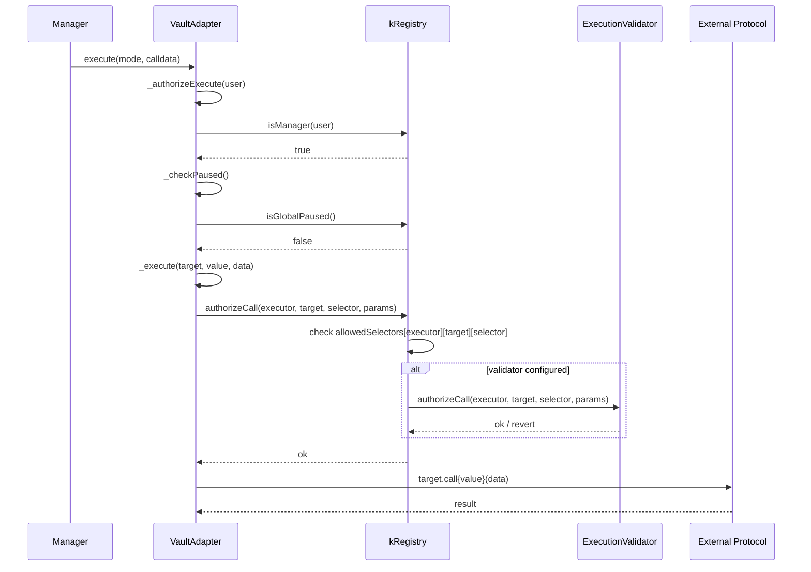

# Adapter Layer

Active contributors: fepvenancio, Solthodox, fv3n, addressZero — see [maintainers](../maintainers.md).

The adapter layer mediates all KAM protocol interactions with external DeFi protocols. It provides permission-based execution so strategy operators can deploy capital into yield-generating positions while the protocol retains full control over which targets, selectors, and parameters are allowed.

## Purpose

- **Secure external execution** — only MANAGER-role holders can invoke `execute()` on adapters; the registry must approve every target, function selector, and (optionally) call parameters before the call reaches the external protocol.
- **Virtual balance accounting** — each adapter tracks `totalAssets()` so the kAssetRouter can reconcile virtual protocol balances against real strategy positions at settlement time.
- **Fund recovery** — ADMIN can rescue any asset (including strategy assets) from an adapter in an emergency.

## How it works

### Contract hierarchy

```
MinimalSmartAccount (external dep: minimal-smart-account)
    │  _execute(target, value, data)
    │      ├── authorizeCall(executor, target, selector, params)  ← registry
    │      └── target.call{value}(data)
    │
    └── SmartAdapterAccount (src/adapters/SmartAdapterAccount.sol)
            │  _authorizeExecute → registry.isManager(msg.sender)
            │
            └── VaultAdapter (src/adapters/VaultAdapter.sol)
                   │  setPaused, setTotalAssets, totalAssets, pull
                   │  contractName, contractVersion
```

### VaultAdapter (`src/adapters/VaultAdapter.sol`, ~180 lines)

The VaultAdapter is a **UUPS upgradeable minimal proxy** that inherits from `SmartAdapterAccount` (which inherits from `MinimalSmartAccount`). Each vault-asset pair gets its own adapter instance.

| Function | Caller | Purpose |
|----------|--------|---------|
| `execute(mode, calldata)` | MANAGER | Performs a call to an external DeFi target after registry authorization |
| `setPaused(bool)` | EMERGENCY_ADMIN | Pauses adapter execution. Also checked against registry-wide global pause |
| `setTotalAssets(uint256)` | kAssetRouter only | Updates the virtual balance after settlement execution |
| `totalAssets()` | Anyone | Returns current recorded total assets |
| `pull(address, uint256)` | kAssetRouter only | Transfers assets out of the adapter during settlement |

**Pause check** (`_authorizeExecute`): validates both local `VaultAdapterStorage.paused` and the registry-wide `isGlobalPaused()`. If either is true, execution reverts with `VAULTADAPTER_IS_PAUSED`.

**Router check** (`_checkRouter`): `setTotalAssets` and `pull` verify the caller is `kRegistry.getContractById(K_ASSET_ROUTER)`.

### SmartAdapterAccount (`src/adapters/SmartAdapterAccount.sol`)

Thin layer over `MinimalSmartAccount` that overrides two behaviours:

1. **`_authorizeExecute`** — replaces the parent's `EXECUTOR_ROLE` check with `registry.isManager(_caller)`. Only MANAGER-role holders can execute.
2. **`_authorizeUpgrade`** — restricts UUPS upgrades to `onlyOwner`.

### Execution validators

Validators add an optional third layer of permissioning on top of the registry's target/selector allowlist. They are configured per-adapter-target via `kRegistry.setExecutionValidator()`.

#### ERC20ExecutionValidator (`src/adapters/parameters/ERC20ExecutionValidator.sol`)

Validates ERC20 `transfer`, `transferFrom`, and `approve` calls. Admin-only configuration.

| Selector | Validations |
|----------|------------|
| `transfer(address,uint256)` | Receiver must be allowlisted per token; cumulative block amount ≤ `maxSingleTransfer` |
| `transferFrom(address,address,uint256)` | Source AND receiver must be allowlisted per token; cumulative block amount ≤ `maxSingleTransfer` |
| `approve(address,uint256)` | Spender must be allowlisted per token |
| Any other selector | Reverts `EXECUTIONVALIDATOR_SELECTOR_NOT_ALLOWED` |

Key security: `authorizeCall` is **registry-only** (`msg.sender == address(registry)`). External callers cannot exhaust per-block transfer limits.

#### ERC4626ExecutionValidator (`src/adapters/parameters/ERC4626ExecutionValidator.sol`)

Validates ERC4626 MetaWallet `deposit`, `mint`, `withdraw`, and `redeem` calls. Permissions are scoped by **executor**, **vault**, **receiver**, and **owner** to prevent path-sharing across adapters.

| Selector | Validations |
|----------|------------|
| `deposit(assets, receiver)` | Vault must be allowed; receiver must be allowed for this `(executor, vault)` |
| `mint(shares, receiver)` | Vault must be allowed; receiver must be allowed for this `(executor, vault)` |
| `withdraw(assets, receiver, owner)` | Vault must be allowed; receiver AND owner must be allowed for this `(executor, vault)` |
| `redeem(shares, receiver, owner)` | Vault must be allowed; receiver AND owner must be allowed for this `(executor, vault)` |

### Execution flow diagram



## Integration points

- **kAssetRouter** calls `setTotalAssets()` and `pull()` during settlement execution.
- **kRegistry** (`ExecutionGuardianModule`) holds the selector allowlist and validator configuration.
- **EMERGENCY_ADMIN** calls `setPaused()` for per-adapter emergency stops.
- **ADMIN** can call `rescueAssets()` and `rescueETH()` for emergency fund recovery.
- **MANAGER** (strategy execution service) calls `execute()` to deploy capital into external DeFi protocols.

## Key source files

| File | Description |
|------|-------------|
| `src/adapters/VaultAdapter.sol` | Main adapter with pause, totalAssets tracking, and router-only pull |
| `src/adapters/SmartAdapterAccount.sol` | MANAGER-role authorization layer over MinimalSmartAccount |
| `src/adapters/parameters/ERC20ExecutionValidator.sol` | ERC20 transfer/approve parameter validation with per-block limits |
| `src/adapters/parameters/ERC4626ExecutionValidator.sol` | ERC4626 vault parameter validation with executor/vault/receiver/owner scoping |

## Related pages

- [kAssetRouter](kasset-router.md) — settlement coordinator that calls `setTotalAssets` and `pull`
- [Security model](../security/index.md) — adapter permission system and trust boundaries
- [kRegistry](kregistry.md) — selector allowlist and validator configuration
- [Configuration](../reference/configuration.md) — adapter deployment config and parameter checker settings
