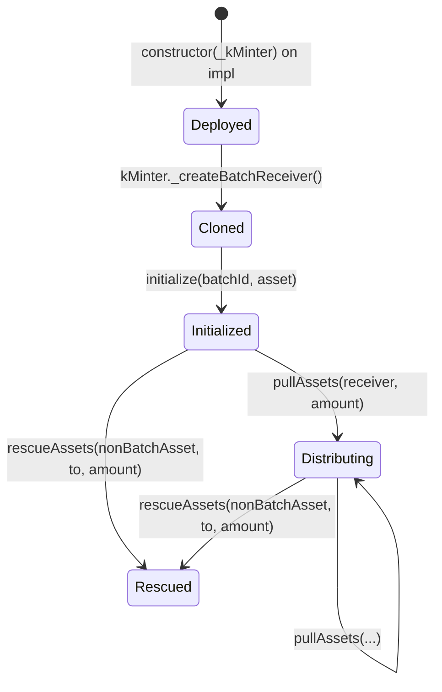

# kBatchReceiver

Active contributors: Solthodox, fv3n — see [maintainers](../maintainers.md).

kBatchReceiver is a minimal proxy contract deployed per redemption batch. Each instance is immutable and single-purpose: it receives settled assets from the kMinter and distributes them to institutional users who have claimed their burned kTokens.

## Purpose

- **Isolated asset distribution** — each redemption batch gets its own receiver, preventing cross-batch contamination.
- **Trust-minimized escrow** — the receiver has no admin, no upgrade mechanism, and only the originating kMinter can trigger payouts.
- **Emergency recovery** — kMinter can rescue accidentally sent ETH or non-batch ERC20 tokens.

## How it works

### Deployment

kBatchReceiver uses the **EIP-1167 minimal proxy** pattern. A single implementation is deployed once, and each new batch receives a cheap clone (via `OptimizedLibClone`) created by `kMinter._createBatchReceiver()`. The receiver is created lazily on the first `requestBurn` in a given batch.

```solidity
constructor(address _kMinter)  // immutable; called once on the impl
initialize(bytes32 _batchId, address _asset)  // called per clone
```

After `initialize`, the receiver is permanently linked to one batch and one asset. Re-initialization is blocked by the `isInitialised` flag.

### Core operations

| Function | Caller | Purpose |
|----------|--------|---------|
| `pullAssets(address receiver, uint256 amount)` | kMinter only | Transfers batch asset to the user claiming their redemption |
| `rescueAssets(address asset, address to, uint256 amount)` | kMinter only | Recovers accidentally sent ERC20 tokens (cannot rescue the batch asset) or ETH |

### Access control

Every state-changing function starts with `_checkMinter(msg.sender)`, which reverts unless the caller is the immutable `K_MINTER` address set at construction.

### State

| Field | Type | Set by | Purpose |
|-------|------|--------|---------|
| `K_MINTER` | `address` (immutable) | `constructor` | Only authorized caller |
| `asset` | `address` | `initialize` | The underlying asset this receiver distributes |
| `batchId` | `bytes32` | `initialize` | Links to a specific kMinter batch |
| `isInitialised` | `bool` | `initialize` | Prevents re-initialization |

### Asset rescue

`rescueAssets` distinguishes two cases:

- **`_asset == address(0)`**: rescues native ETH via low-level `call{value}`.
- **`_asset != address(0)`**: rescues an ERC20 token, but **the batch asset itself cannot be rescued** (reverts with `KBATCHRECEIVER_WRONG_ASSET`). This protects user redemption funds from being drained.

### Lifecycle



## Integration points

- **kMinter** deploys clones, calls `pullAssets` for user claims, and calls `rescueAssets` for emergency recovery.
- **kAssetRouter** settles assets into the receiver during `executeSettleBatch`.
- **Institutions** receive payouts via `pullAssets` when they call `kMinter.burn(requestId)`.

## Key source files

| File | Description |
|------|-------------|
| `src/kBatchReceiver.sol` | Full implementation (~153 lines) |
| `src/interfaces/IkBatchReceiver.sol` | Interface definition |

## Related pages

- [kMinter](kminter.md) — creates and manages batch receivers
- [Batch lifecycle](../features/batch-lifecycle.md) — how batches flow from OPEN through SETTLED
- [Security model](../security/index.md) — batch isolation guarantees
